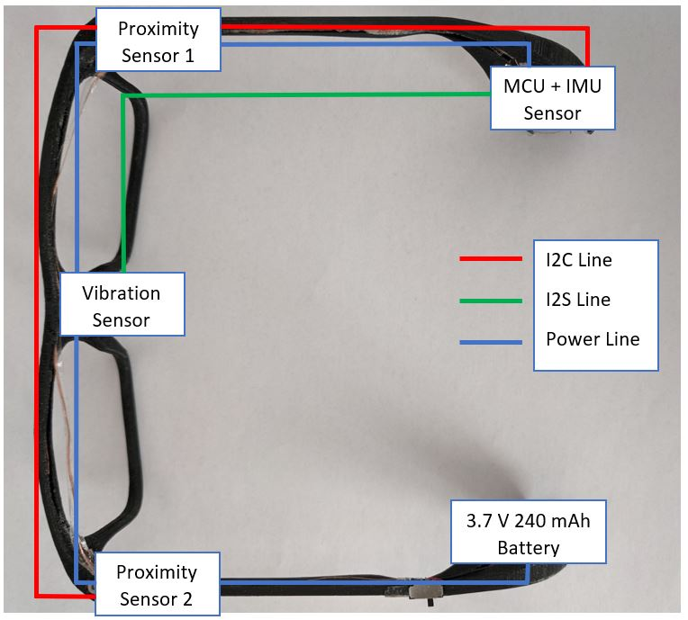
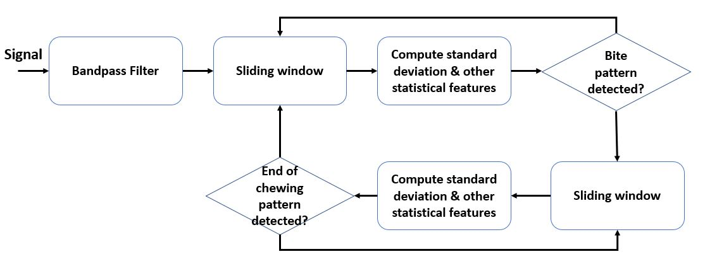

# online_chewing_detection
A multi-purpose context-aware smart eyeglasses is being developed to support the field of automated dietary monitoring. This project provides python implementation of online bite detection algorithm which is able to monitor eating activities in real-time. The algorithm is designed based on timeseries analysis of proximity data, which aims to detect signal pattern at the start (bite) and at the end of chewing signal. Standard deviation and other data features are computed to recognize bite event in a windowed signal.

The smart eyeglasses system integrates microcontroller and proximity sensor as follows:
<!-- .element height="50%" width="50%" -->

The sensors are sampled at 50 Hz. Data is recorded during eating activities and stored on a flash memory. The following pipeline is proposed for bite detection algorithm:
<!-- .element height="10%" width="10%" -->
