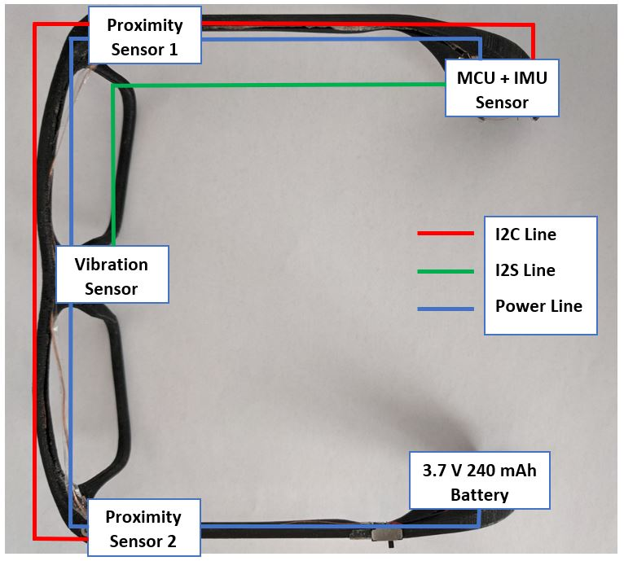

# online_chewing_detection
A multi-purpose context-aware smart eyeglasses is being developed to support the field of automated dietary monitoring. This project provides python implementation of online bite detection algorithm which is able to monitor eating activities in real-time. The algorithm is designed based on timeseries analysis of proximity data, which aims to detect signal pattern at the start (bite) and at the end of chewing signal.

The smart eyeglasses system integrates microcontroller and proximity sensor as follows:
<!-- .element height="50%" width="50%" -->

The sensors are sampled at 50 Hz. The scenario used for recording: before chewing, during chewing and after chewing. Recording files are stored on a flash memory for further analysis. The following pipeline is proposed for bite detection algorithm:
<!-- .element height="10%" width="10%" -->

The change of signal swing that goes up dramatically can be observed clearly before and during chewing. Thus, standard deviation is computed to recognize bite event in a windowed signal. Values of starting point, end point and lowest point are also computed for shape matching of typical 'trench' at the beginning of bite event. Similar approach is implemented to detect end of chewing
<!-- .element height="10%" width="10%" -->
<!-- .element height="10%" width="10%" -->

Future work includes development of context recognition database for different daily activities such as walking, exercising and working at a desk. The database can also be utilized for supervised learning algorithm development in the future.
