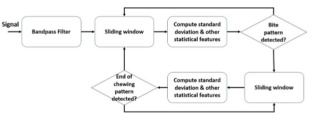

# online_bite_detection

## Overview

  

A multi-purpose context-aware smart eyeglasses is being developed to support the field of automated dietary monitoring. The smart eyeglasses system integrates microcontroller and multiple sensors. This project provides python implementation of online bite detection algorithm using proximity sensor data sampled at 50 Hz. The code can be ported to C/C++ that is widely used in microcontroller programming. Hence, the algorithm is able to monitor eating activities in real-time. It is designed based on timeseries analysis of proximity data, which aims to detect signal pattern at the start (bite) and at the end of chewing signal. The scenario used for recording: before chewing, during chewing and after chewing. Recording files are stored on a flash memory for further analysis. A pipeline is proposed for bite detection algorithm.

   

Signal swing that goes up dramatically can be observed clearly before and during chewing. Thus, standard deviation is computed to recognize bite event in a windowed signal. Values of starting point, end point and lowest point are further observed to match typical 'trench' at the beginning of bite event. Similar approach is implemented to detect the end of chewing.

<!-- .element height="10%" width="10%" -->

Test results show the algorithm can achieve a recognition performance of 80.95% by selecting a certain classifier. This promising outcome implies this approach has a good potential for further development.

  
   

## Wiki
Run bite_detection.ipynb to see algorithm's workflow step by step. Sample recording is provided in this repository.

## Future work

Future work includes the development of context recognition database for different daily activities such as walking, exercising and working at a desk. The database can also be utilized for supervised learning algorithm development in the future.
